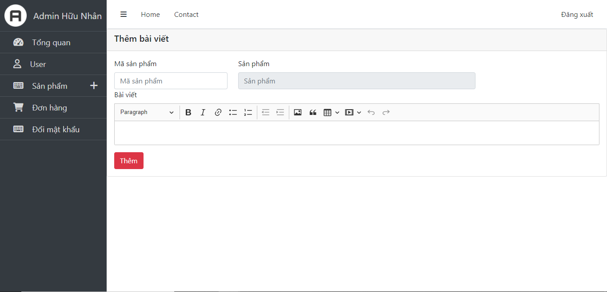

# H2T COMPUTER - LAPTOP, LINH KIỆN MÁY TÍNH

## CÁC CÔNG NGHỆ SỬ DỤNG

- **Frond-End:** HTML, CSS, Javascript, Jquery, [Bootstrap](https://getbootstrap.com/)
- **Back-End:** PHP 8
- **Database:** MySQL
- **Libraries** [Chart.js](https://www.chartjs.org/)
- **Bảo mật:** SQL Injection, XSS, CSRF

## [DEMO](http://H2Tcomputer.com/)

## HÌNH ẢNH

